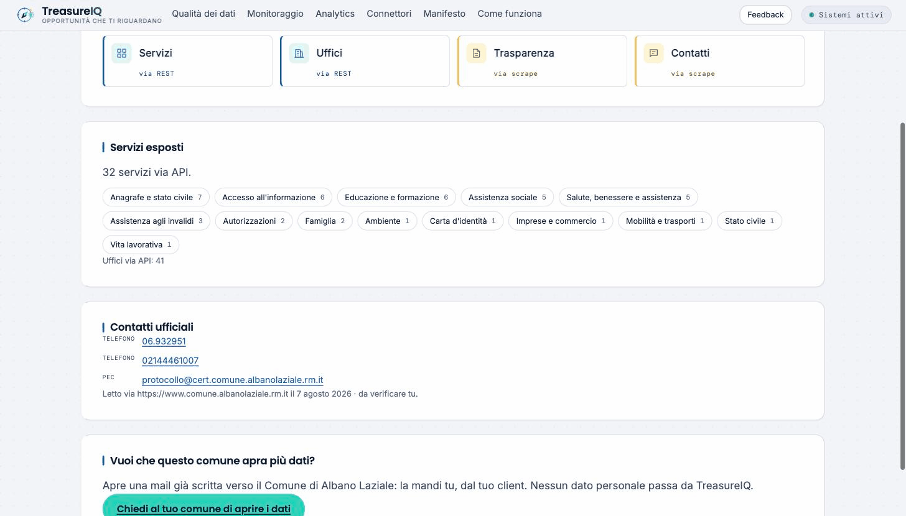
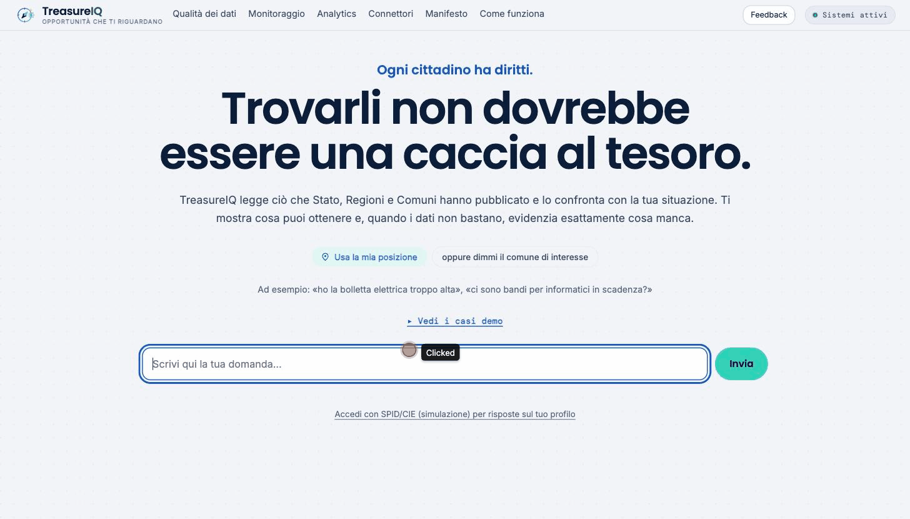

# TreasureIQ

Accedere alle informazioni dei comuni e delle PA non deve essere una caccia al
tesoro. TreasureIQ ti aiuta a trovarle.

Oggi ci parli in italiano. TreasureIQ risponde su agevolazioni comunali,
recapiti e orari degli uffici, bandi e scheda del comune — confrontando i
servizi che un comune pubblica con la situazione del cittadino — **e dice
quando il Comune non ha pubblicato abbastanza perché la domanda abbia
risposta**.

Risponde su due livelli, e non li confonde mai. Sui **tre comuni censiti** ha
uno snapshot ricco in git e, su richiesta, estrae dai PDF i criteri di un
bando. Su **qualunque altro comune riconosciuto** (7.896 per nome) legge il
portale al momento — la sezione Amministrazione Trasparente per i bandi, gli
uffici dove il portale li espone — e marca ogni riga con la sua provenienza:
letto ora, verificato, o trovato sul web e da confermare. Quale delle due
strade prende lo decide la forma della domanda, non un elenco di comuni
privilegiati.

Progetto realizzato per il **SuperAgents Civic Hackathon** (Play New, 2026).

---

## Il problema, misurato

Il Comune di Albano Laziale pubblica 32 servizi tramite un'API aperta. Il tema
WordPress che usa — il modello **Design Comuni Italia** — prevede un campo
dedicato ai requisiti di accesso, `_dci_servizio_vincoli`.

| Misurazione (snapshot del 2 agosto 2026) | Valore |
|---|---|
| Record comunali nello snapshot | 42 — 32 via API WordPress, 10 da pagine HTML |
| Campo requisiti **presente** | 32 / 32 sui record via API |
| Campo requisiti **compilato** | **1 / 42** |
| …e nemmeno quello è tipizzato | 0 / 42 |
| Record che citano l'ISEE nel testo | 10 / 42 |
| …di cui con una cifra accanto all'ISEE | 4 / 42 |
| …di cui con soglia effettivamente estraibile | 2 / 42 |
| Dataset del comune su dati.gov.it | **0** |

Nella chat i record diventano 45: ai 42 comunali si aggiungono 3 misure
nazionali e regionali curate a mano (`data/seed/nazionale_curated.json`), che
esistono perché un cittadino con la bolletta alta ha diritto di sapere del bonus
sociale anche se il suo comune non lo pubblica. Sono marcate come tali e non
entrano in nessuna pagella comunale: misurare un comune su dati scritti da noi
sarebbe misurare noi stessi.

Ogni numero è riproducibile contro lo snapshot committato in `data/seed/`.

I dati esistono. Non sono leggibili da una macchina.

**Non stiamo proponendo un nuovo standard.** Lo standard c'è già ed è quello che
il comune sta usando: il campo è vuoto, non assente. L'unico compilato contiene
requisiti veri ma in prosa libera — quindi resta il limite del modello stesso,
che quel campo non è tipizzato.

---


### E non è un caso isolato: misurato su tutta Italia

Il 12 agosto 2026 TreasureIQ ha censito **tutti i 7.896 comuni italiani** —
34.229 richieste, circa quattro per comune, novanta minuti.

| | |
|---|---|
| Comuni censiti | **7.896** — tutti |
| Servizi comunali contati | **57.603** |
| Piattaforme riconosciute | 23, l'85,6% dei comuni |
| Comuni con aderenza al modello AgID misurata | 1.856 |

E il numero che il progetto esisteva per trovare. Sugli **811 comuni** dove la
domanda si può porre — quelli su piattaforme con campi tipizzati, dove il campo
dei requisiti esiste *come campo*:

| | Comuni | |
|---|---|---|
| Campo presente, **lasciato vuoto** | **764** | **94,2%** |
| Requisiti pubblicati | 38 | 4,7% |
| Campo assente dallo schema | 9 | 1,1% |

Le ultime due righe non vanno sommate: `assente` è una scelta del fornitore,
`vuoto` una del comune, e confonderle darebbe la colpa a chi non ce l'ha.

Due misure indipendenti, su popolazioni diverse, arrivano alla stessa
conclusione: il 92% dei servizi che leggiamo servizio per servizio, e il 94%
dei comuni misurati uno per uno.

### Chi serve davvero i comuni italiani

Il tema WordPress finanziato da AgID è **sesto**.

| Piattaforma | Comuni | Quota |
|---|---|---|
| PeopleWeb (Siscom) | 1.120 | 14,2% |
| Municipium (Maggioli) | 1.010 | 12,8% |
| HGATE | 956 | 12,1% |
| *non riconosciuta* | 844 | 10,7% |
| WordPress generico | 727 | 9,2% |
| **WordPress Design Comuni** | 713 | 9,0% |

E **323 comuni** stanno su piattaforme condivise messe a disposizione dalla
propria Regione — Friuli-Venezia Giulia, Veneto, Rete Civica Lepida in
Emilia-Romagna. È il modello che altrove ogni comune affronta da solo.


## Come funziona

Tre atti distinti, non un monolite: **due acquisizioni** che girano prima e
lontano dalla domanda, e **una risposta** che si compone mentre il cittadino
aspetta. Non è un'architettura a microservizi, e chiamarla così farebbe scena
senza essere vero.

### Sweep e ingestione: due acquisizioni diverse

È la distinzione che più spesso si confonde, perché entrambe «leggono un
comune». Ma leggono cose diverse, con proprietà opposte, e alimentano parti
diverse della risposta.

| | **Sweep** (`registro.py`) | **Ingestione** (`ingest/`) |
|---|---|---|
| Cosa legge | l'**identità** del portale: piattaforma, logo, uffici, recapiti | i **contenuti**: agevolazioni e bandi che il cittadino confronta |
| Cosa salva | la scheda del comune + i fingerprint di cambiamento | il corpus `Opportunity`, con la pagella di readiness |
| Ampiezza | quasi nazionale — molti comuni scansionati | un comune reale a fondo (Albano); gli altri a zero, per ora |
| Riproducibile | **sì**: fingerprint stabili, esclude apposta il set-pagine | **no**: il set-pagine cambia a ogni run |
| Cosa alimenta | la scheda civica a lato e la sonda live | il verdetto di eleggibilità |

Lo sweep **scopre** (che piattaforma è, dove sta l'ufficio); l'ingestione
**capisce** (che dice quel bando, chi ne ha diritto). Il primo dà al secondo le
coordinate — piattaforma ed endpoint — ma i due artefatti restano separati:
fondere il corpus dentro il record dello sweep ne avvelenerebbe la
change-detection, che vive proprio dell'escludere ciò che cambia a ogni lettura.

<table>
<tr>
<td width="50%"><b>Sweep — la scheda di un comune</b><br/><br/></td>
<td width="50%"><b>Ingestione — il verdetto</b><br/><br/></td>
</tr>
</table>

**Prima della domanda** — gira quando vogliamo noi, e finisce in file versionati:

```
ingest/          → connettori per fonti di qualità diversa (WP REST, HTML)
    ↓              ogni connettore misura quanta struttura ha recuperato
schema.py        → Opportunity: schema comune, proposto come spec aperta
    ↓
extract/         → recupero dei criteri dalla prosa (modello), cache committata
    ↓
data/seed/       → snapshot in git: ogni numero del README è riproducibile
    ↓
readiness.py     → pagella 0-100 sulla qualità dei dati del comune
```

**Mentre il cittadino aspetta** — `web` (Next) parla solo con `api` (FastAPI),
sulla stessa origine:

```
domanda in italiano
    ↓
chat/intent.py   → che FORMA ha la domanda. È tutto ciò che fa il modello
    ↓
    ├─ agevolazione → match/engine.py: confronto sui campi, nessun modello
    ├─ bandi        → comune censito: dallo snapshot, criteri estratti dai PDF
    │                 altro comune: sonda_live legge Amministrazione Trasparente ORA
    └─ informazione → documento + ufficio dallo snapshot
            ↓ (se il comune non è censito)
         sonda_live → legge il portale ORA, verbatim, non conserva
            ↓ (se il portale non espone gli uffici)
         ricerca web → Brave, ancorata al dominio del comune (site:), «non verificato»
    ↓
scheda civica    → ogni riga con la sua provenienza
```

`chat/intent.py` capisce la FORMA della domanda — comune, argomento — ma non
riempie più gli slot anagrafici. È `chat/filtri.py` (`riconosci_filtri`) a
estrarli, in modo deterministico: enum `FiltroChiave` a 10 valori (comune,
disabilità, disabilità nel nucleo, figli minori, età, anziano, ISEE, nucleo
familiare, stato occupazionale, tema). Lemmi e negazione passano da spaCy
(`it_core_news_lg`, scaricato nel build Docker) quando il modello è
disponibile, da una cue-list italiana come ripiego onesto quando non lo è —
mai da un'eccezione che spezza il modulo. Ogni filtro letto dal testo porta lo
span verbatim che lo giustifica: senza span, nessun filtro. Zero LLM nelle
cifre che decidono l'eleggibilità (D-07).

I sinonimi civici di «bando» nel messaggio — agevolazione, contributo,
sovvenzione, sussidio, bonus, incentivo — fanno scattare, accanto alla
risposta di agevolazione, una scansione bandi live dello stesso comune:
additiva, mai al posto della risposta (`_forse_aggiungi_bandi_live` in
`chat/respond.py`).

Il testo della risposta — le cifre, le scadenze, quanti bandi corrispondono a un
tema — è sempre un modello di frase deterministico, mai generato dal modello. Il
modello capisce la domanda; non scrive un numero. Un verbalizzatore libero,
messo alla prova, corrompeva le cifre: la guardia non è un prompt, è che quel
testo non passa mai da un LLM.

I tre gradini si scendono **in ordine**, e un dato trovato non si presenta mai
come un dato letto. Il diagramma completo è su `/info`; le rotte sono
documentate in [`docs/api.md`](docs/api.md).

### Tre scelte che reggono il progetto

**L'eleggibilità non la decide il modello.** Il verdetto viene da confronti
espliciti sui campi dei requisiti. L'LLM serve solo a *recuperare* i criteri dal
testo, mai a decidere. Un cittadino può agire su ciò che restituiamo, e una
regola leggibile è una regola correggibile.

**Logica a tre valori.** Ogni criterio è soddisfatto, non soddisfatto o
**ignoto**, e "ignoto" è un esito di prima classe. Con 31 servizi su 32 che non
dichiarano requisiti, un motore a due valori deve indovinare: se tratta l'ignoto
come eleggibile inonda le persone di domande che non possono vincere, se lo
tratta come escluso nasconde diritti. Il motore si rifiuta di indovinare e lo
dice.

**Il punteggio misura la PA, non noi.** Il Data Readiness Score si basa su cosa
la fonte ha *dichiarato*, mai su cosa il nostro estrattore è riuscito a leggere.
Addebitare al comune un buco del nostro parser renderebbe il numero una misura
di noi stessi.

L'estrattore LLM deve inoltre citare la frase esatta da cui ricava ogni valore:
senza citazione il valore viene scartato. È la difesa più economica contro
un'allucinazione sicura di sé.

---

## Eseguire il progetto

Lo snapshot dei dati reali e la cache di estrazione sono **committati nel
repository**, e i font sono ospitati localmente: l'applicazione si costruisce e
gira interamente senza rete e senza API key.

```bash
git clone https://github.com/stanzinofree/TreasureIQ.git
cd TreasureIQ
make up          # build delle immagini al primo avvio, poi le avvia
```

`make up` è la via ergonomica: verifica Ollama, costruisce e avvia i container in
background e stampa gli indirizzi. Senza `make` l'equivalente è `docker compose up
--build`.

Poi apri <http://localhost:3000>, oppure il dominio OrbStack se lo usi:
<https://web.treasureiq.orb.local>. Funzionano entrambi senza configurare
niente, perché il browser chiama percorsi relativi sulla propria origine e Next
li inoltra all'API.

Prima di una demo conviene scaldare la cache dei comuni fuori copertura, così la
prima domanda non aspetta la rete:

```bash
make scalda-cache COMUNI='Ciampino Camposampiero'
```

L'API è pubblicata su <http://localhost:8010> — non 8000, che su molte macchine
con OrbStack o Docker Desktop è già occupata, con l'effetto che le richieste
raggiungono il processo sbagliato e restituiscono 404 in un modo che sembra un
bug dell'applicazione.

### Il Makefile

`make` da solo (o `make help`) elenca i comandi. I più utili nel ciclo di vita
del progetto:

| Comando | Cosa fa |
|---|---|
| `make up` | build al primo avvio, poi avvia api (`:8010`) e web (`:3000`) |
| `make restart` | ferma e riavvia lo stack |
| `make rebuild` | ricostruisce le immagini dal sorgente, poi riavvia (fa prima un backup) |
| `make down` | ferma lo stack; i dati restano nei bind mount |
| `make logs` | segue i log di api + web |
| `make status` | stato dei container, `GET /api/health` e check di Ollama |
| `make scalda-cache COMUNI='…'` | sonda ora i comuni fuori copertura, per la demo |
| `make test` | esegue la suite pytest nello stage `dev` del Dockerfile |
| `make backup` · `make restore FILE=…` | tar di `storico.db` + `data-live/`, e ripristino |

Rigenerare i dati sono operazioni pesanti e **non** servono per far girare la copia
già committata: `make scan-nazionale` rifà il censimento nazionale in `storico.db`,
`make sweep ISTAT='058057'` fa censimento e registro per un set di comuni,
`make registro-list` elenca cosa è stato letto.

### Eseguire senza Docker

<details>
<summary>Avvio manuale di API e web</summary>

Requisiti: Python 3.11+, Node.js 20+.

#### API

```bash
cd api
python -m venv .venv && .venv/bin/pip install -r requirements.txt
PYTHONPATH=. .venv/bin/python -m uvicorn treasureiq.api:app --host 127.0.0.1 --port 8010
```

> La porta è 8010, non 8000: su molte macchine con OrbStack o Docker Desktop la
> 8000 è già occupata e `localhost:8000` finisce altrove restituendo 404.

#### Web

```bash
cd web
npm install
npm run dev
```

Apri <http://localhost:3000>.

</details>

### Ingestion (opzionale, richiede rete)

Per rigenerare lo snapshot dalle fonti attuali:

```bash
cd api
PYTHONPATH=. .venv/bin/python -m treasureiq.ingest --help     # opzioni
PYTHONPATH=. .venv/bin/python -m treasureiq.ingest            # dry run
PYTHONPATH=. .venv/bin/python -m treasureiq.ingest --write    # applica
```

Senza `--write` non viene scritto nulla: gli snapshot sono artefatti committati,
e riscriverli in silenzio è il modo in cui una demo smette di corrispondere ai
numeri citati intorno a lei.

L'estrazione LLM richiede `ANTHROPIC_API_KEY`. Senza chiave, l'ingestion usa la
cache committata e i risultati restano identici.

---

## Demo e documentazione

| File | Cosa contiene |
|---|---|
| [`demo/copione.md`](demo/copione.md) | Copione da 3 minuti: quattro casi, battute cronometrate, i punti dove fermare l'immagine. |
| [`demo/copione-10min.md`](demo/copione-10min.md) | Versione estesa: aggiunge il profilo simulato, gli omonimi e la pagella. |
| [`docs/api.md`](docs/api.md) | Le rotte, e soprattutto cosa significano le risposte. |
| `/info` | La mappa del sistema e il ciclo completo, dalla domanda alla risposta. |

## Autenticazione

Il flusso di accesso è una **simulazione di SPID**. Nessuna credenziale viene
verificata.

Integrare SPID davvero richiede una convenzione con un Aggregatore o un Identity
Provider e il collaudo AgID: non è ottenibile nei tempi di un hackathon. I campi
del profilo ricalcano però gli attributi che SPID rilascia realmente, più quelli
di means-testing che verrebbero dall'INPS, così il percorso di sostituzione
resta vero — al posto del form va un redirect OIDC e il profilo arriva nella
stessa forma.

Un prototipo che lasciasse credere a un'integrazione reale sarebbe la scelta
disonesta.

---

## Limiti dichiarati

- **Tre comuni censiti, non l'Italia.** Albano Laziale (45 record, pagella
  34.3), Fonte Nuova (37, 43.5), Ariccia (18, 14.9). I comuni limitrofi in gran
  parte non espongono API — Castel Gandolfo risponde 410, Genzano 404 — e per
  questo esistono connettori diversi per livelli di qualità diversi. Il
  connettore CKAN non è ancora implementato.
- **Censiti e riconosciuti sono due numeri diversi.** Tre comuni hanno uno
  snapshot; 7.896 sono riconosciuti per nome e, se il loro portale si lascia
  leggere, ricevono una risposta letta al momento. Vanno detti come due numeri
  diversi, sempre.
- **Riconoscere una piattaforma non è saperla leggere.** Il censimento identifica
  23 piattaforme, ma la lettura live struttura solo quelle che espongono la
  sezione Amministrazione Trasparente in modo raggiungibile. Municipium (Maggioli),
  seconda per diffusione al 12,8%, serve i dati da una propria API su tenant
  numerico e non da un percorso pubblico: il connettore la legge in forma parziale
  — gli uffici dalla sitemap e l'indice di Amministrazione Trasparente — mentre la
  lettura completa dei servizi resta da fare. Pomezia, che la usa, è coperta a
  metà, non del tutto.
- **La ricerca web non è una fonte.** È l'ultimo gradino, serve solo dove il
  portale non espone i propri uffici, e quello che restituisce arriva marcato
  `non_verificato` e da confermare con l'URP. Non entra in nessuno snapshot e
  non conta nella copertura.
- **Nessun verdetto è "eleggibile".** Nessun record pubblica requisiti
  tipizzati, quindi nessun match può essere confermato. Non è un difetto del
  motore: è il risultato onesto sui dati reali, ed è la tesi del progetto resa
  visibile.
- **Lo snapshot è una copia puntuale.** La fonte autorevole resta la pagina del
  comune, a cui ogni risultato rimanda.

---

## Come è stato costruito

Il codice di questo progetto è stato scritto con **KAPI**, il mio agente
digitale, costruito su Claude di Anthropic.

Ha fatto la ricognizione sulle fonti dal vivo invece di fidarsi della
documentazione, e proprio così ha trovato le cose che contano: che il `rest_base`
del post type `servizio` è `servizi`, che i comuni limitrofi non espongono
alcuna API, e che il campo dei requisiti è compilato su un servizio su
trentadue. Ha scritto i connettori, il motore di eleggibilità e il Data
Readiness Score, e li ha verificati eseguendoli sui dati reali a ogni passo —
diversi difetti in questo repository sono stati trovati perché il codice è stato
messo in esecuzione, non riletto.

Le decisioni di prodotto, la direzione visiva e il taglio dell'argomento verso
le pubbliche amministrazioni sono mie.

---

## Licenza

[Apache License 2.0](LICENSE) — vedi anche [NOTICE](NOTICE).

Apache anziché MIT per una ragione precisa: il progetto chiede a pubbliche
amministrazioni e a loro fornitori di adottare uno schema e un metodo, e la
concessione esplicita di brevetto rimuove un'obiezione che una revisione legale
solleverebbe.

Copyright 2026 Alessandro Middei.

## Documentazione

| | |
|---|---|
| [docs/architettura.md](docs/architettura.md) | com'è fatto il sistema, con le dimensioni misurate |
| [docs/roadmap.md](docs/roadmap.md) | in che ordine procedere, e perché quell'ordine |
| [docs/da-fare.md](docs/da-fare.md) | cosa è rotto, cosa manca, quanto costa ciascuna cosa |
| [docs/connettori.md](docs/connettori.md) | quali piattaforme leggiamo e fin dove |
| [docs/evoluzione.md](docs/evoluzione.md) | cosa costruire dopo l'MVP, e cosa scartare |
| [docs/sicurezza.md](docs/sicurezza.md) | abuso, cortesia verso i portali, dati sensibili |
| [docs/api.md](docs/api.md) | Swagger su `/docs`, collection Bruno in `bruno/` |
