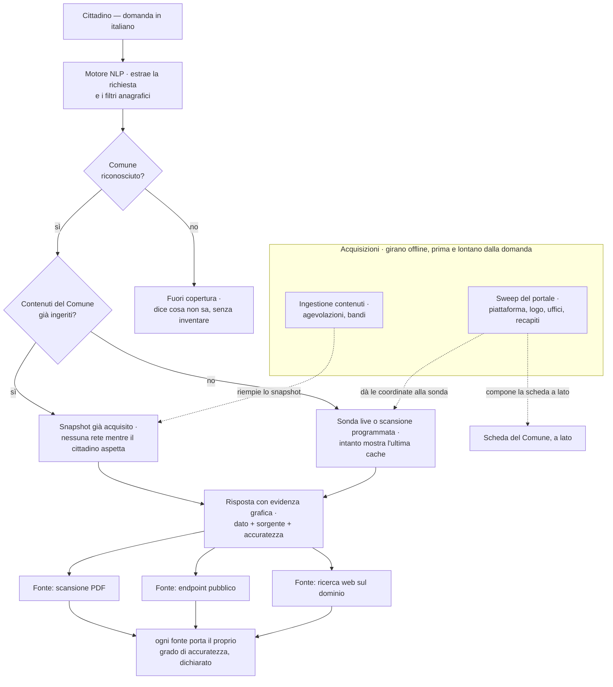

# Come TreasureIQ legge un Comune

*In una riga: TreasureIQ è il **punto d'ingresso** del cittadino ai portali dei
Comuni. Fa una domanda in italiano, riceve una risposta con la fonte e il grado
di accuratezza dichiarati — mai una certezza inventata.*

Ma «leggere un Comune» non è un atto solo. Sono **due**, diversi, ed è la
distinzione che questa pagina rende evidente — perché è la parte del progetto
che più spesso si confonde.

---

## Due acquisizioni, non una

Prima e lontano dalla domanda del cittadino girano **due letture distinte**.
Entrambe partono dal portale di un Comune, ma recuperano cose opposte.

| | **Sweep** — l'identità | **Ingestione** — i contenuti |
|---|---|---|
| Cosa legge | piattaforma, logo, uffici, recapiti | agevolazioni e bandi |
| Cosa salva | la scheda del Comune + i fingerprint di cambiamento | il corpus su cui si decide l'eleggibilità |
| Ampiezza | quasi nazionale — molti Comuni scansionati | un Comune reale a fondo (Albano); gli altri a zero, per ora |
| Riproducibile | **sì** — fingerprint stabili | **no** — cambia a ogni run |
| A cosa serve | la scheda civica a lato e la sonda live | il verdetto: chi ne ha diritto |

Lo sweep **scopre** — che piattaforma è, dove sta l'ufficio, come si chiama.
L'ingestione **capisce** — che dice quel bando, chi può chiederlo. Il primo dà
al secondo le coordinate, ma i due restano separati apposta: lo sweep vive del
riconoscere ciò che *non* cambia, l'ingestione legge proprio ciò che cambia.

---

## Lo sweep: la scheda di un Comune

Una scansione del portale ricostruisce l'**identità** del Comune — la
piattaforma su cui gira, il logo, gli uffici, i recapiti ufficiali dell'Indice
PA — e la salva una volta. Alla scansione dopo, un confronto per fingerprint
stabili dice *cosa è cambiato*, senza rileggere tutto.

---

## L'ingestione: il verdetto

Sui contenuti già acquisiti, il cittadino chiede in italiano e riceve un
verdetto. Ogni riga della risposta porta con sé la sua **provenienza** — da
quale PDF, da quale endpoint, da quale pagina — e il modello non decide mai
l'eleggibilità: rilegge soltanto, la regola decide.

---

## Il flusso completo

Quella freccia tratteggiata — *"dà le coordinate alla sonda"* — è la regola
onesta della sonda live: **legge prima quello che lo sweep ha già trovato**
(l'URL di Amministrazione Trasparente, quale piattaforma, quale via REST) e
sonda dal vivo solo quello che manca ancora o non è più fresco. Non
ricontrolla mai per scrupolo un dato già catalogato — sarebbe la stessa
sonda che le coordinate dovevano evitare. Il dettaglio, gradino per gradino,
è in [Connettori](connettori#i-bandi-leggi-prima-poi-tre-gradini-in-cascata-e-il-portale-halley).

---

## E un motore di ingestione?

Sì, come direzione — no, come lavoro di oggi. Lo scheletro c'è già
(`ingest/base.py`: `Connector`, `FetchStats`, la pagella di readiness); quello
che manca è l'orchestrazione: un dispatch **guidato dallo sweep** (la
piattaforma rilevata sceglie il connettore), un corpus riproducibile, uno
scheduling. Resterà un atto **distinto** dallo sweep, non fuso in esso — fonderli
avvelenerebbe la change-detection del registro. Il dettaglio è in
[Architettura](architettura) e in [Roadmap](roadmap).
