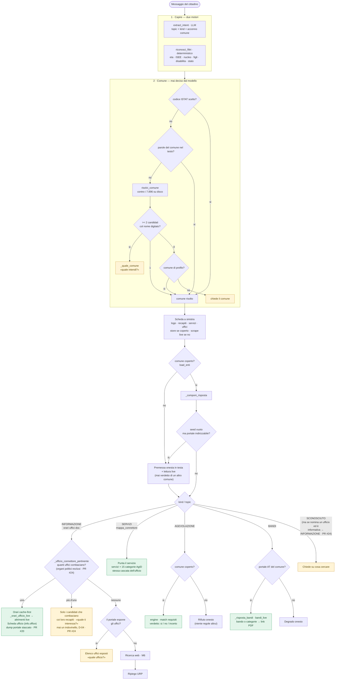

# TreasureIQ — flusso dell'algoritmo di chat

Mappa fedele al codice (`api/treasureiq/chat/respond.py` + `intent.py` + `filtri.py`).
Legge → capisce → risolve il comune → instrada per tipo di domanda → risponde
senza mai contraddire la fonte.

## Punti che tradiscono l'intuito

| Punto | Come sembra | Come è davvero |
|---|---|---|
| Disambiguazione comune | «i più vicini a quello riconosciuto» | i comuni che **combaciano col nome digitato** (match esatto, poi parola-nel-nome). Nessuna prossimità geografica. Il comune **non lo sceglie mai il modello**. |
| Filtri personali | parte dell'NLP | motore **deterministico separato** (`riconosci_filtri`), non l'LLM. |
| Recapiti scheda | una cache | **store se coperto**, **scrape live se fuori copertura** — due sorgenti. |
| Lettura live | solo fuori copertura | scatta **anche su coperto** con seed vuoto e portale indirizzabile. |
| Ufficio non capito | subito URP | prima **elenco uffici esposti + chiedi**, poi web, **poi** URP (coda). |
| Ufficio ambiguo | dump dei 40 uffici o indovinello | **solo i candidati** che combaciano, coi loro recapiti, e sceglie il cittadino (mai un indovinello, D-04 · PR #24). Gli **organi politici** (Commissione/Giunta/Consiglio) restano fuori dal match. |
